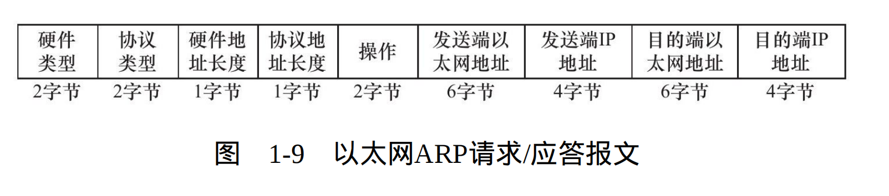
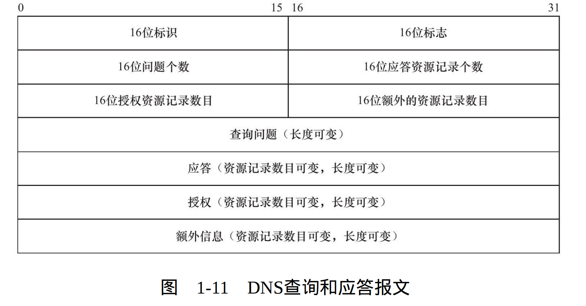
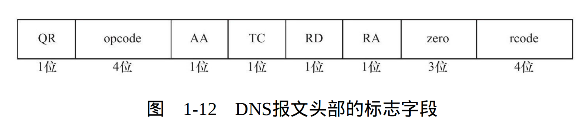
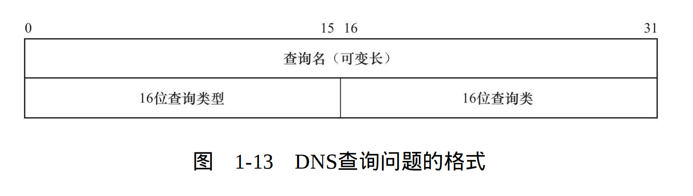
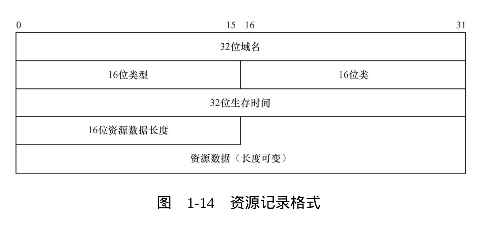

## 网络层

### 一.ICMP协议

#### 1. 8位类型
用于区分报文类型,它将ICMP报文分为两大类:**差错报文**和**查询报文**
##### 1.1 差错报文和查询报文
1. 差错报文主要用来回应网络错误 比如**目标不可达(类型值为3)** 和 **重定向(类型值5)**
2. 查询报文主要用于查询网络信息 比如ping程序用于查询目标地址是否可达到
#### 2. 8位代码
用于进一步细分详细情况 例如代码值0表示对网络重定向 代码值1表示对主机重定向
#### 3. 16位校验和
16位校验和字段对整个报文进行冗余检验，以检查报文在传输过程中是否损坏

## 数据链路层

### 一.ARP协议

#### 1. 2字节硬件类型
定义硬件物理地址类型,类型值为1表示MAC地址
#### 2. 2字节协议类型
表示物理地址要映射的协议类型,类型值为0x800表示IPv4地址
#### 3. 1字节硬件地址长度和协议地址长度
分别表示硬件地址长度和协议地址长度,对MAC地址来说硬件地址长度为6字节,对IPv4来说协议地址长度为4字节
#### 4. 2字节操作
定义操作类型

|值|操作类型|
|--|-------|
|1|ARP请求|
|2|ARP应答|
|3|RARP请求|
|4|RARP应答|

## 应用层

### 一.DNS协议

#### 1. 16位标识字段:
用于标识一对DNS请求和应答,以便区分哪个DNS应答对应哪个DNS请求
#### 2. 16位标志字段:
* 16位标志字段细节:

* **QR字段**:请求/查询标志,**值为0**表示这是一个查询报文,**值为1**表示这是一个应答报文
* **opcode字段**: 定义查询和应答类型,**0**表示标准查询,**1**表示反向查询(由ip地址查询域名),**2**表示请求服务器状态
* **AA字段**:授权应答标志,仅有应答报文使用,1表示域名服务器为授权服务器
* **TC字段**:截断标志,仅当DNS使用UDP服务时,由于UDP数据报对长度有限制可能导致DNS报文被截断。1表示DNS报文长度超过512字节,并被截断
* **RD字段**:递归查询标志 1表示执行递归查询,当DNS服务器未能查询到目标资源,则向其他DNS服务器进行递归查询,直到查询并返回主机。 0标志执行迭代查询,DNS服务未能查询到目标资源,则将其他DNS服务器地址返回给客户端
* **RA字段**:允许递归标志,仅有应答报文使用,值为1表示DNS服务器支持递归查询
* **zero字段**:保留字段,必须填充0
* **rcode字段**:四位返回码,表示应答状态,常用值有0表示无错误·,3表示域名不存在

#### 3. 16位问题个数
对应查询问题数量。对于查询报文来说,至少为1

#### 4. 16位应答资源记录个数
对应响应的资源记录数量。对应答报文来说至少为1。对请求报文来说只能为0

#### 5. 16位授权资源记录数目
对应授权资源记录数量。对于1台DNS服务器,若不是某域名的权威服务器,则可能发起递归查询,对于该DNS服务器,权威服务器返回的资源为授权资源,该字段用于记录授权的资源记录数量.

#### 6. 16位额外的资源记录数目
对应额外信息记录数量。

#### 7. 查询问题
* **格式**:

* **查询名**:使用一定格式封装了要查询的主机域名
* **16位查询类型**:表示如何进行查询.

|类型|值|行为|
|----|---|---|
|A|1|表示获取主机IP地址|
|CNAME|5|表示获取主机的主机别名|
|PTR|12|表示获取主机的IP地址的域名(反向查询)|
* **16位查询类**:常用值为1,表示获取因特网地址.

#### 8.应答 授权 额外信息
* **格式**:都使用资源记录格式

* **32位域名**:某个资源记录对应的查询名.其格式与查询问题的查询名相同
* **16位类型与16位类**:同前
* **32位生存时间**:表示该查询结果能被本地客户端缓存多长时间
* **16位资源记录长度,资源数据**：取决于类型字段,若为A类型,则资源数据为32位ipv4地址,长度为4字节
