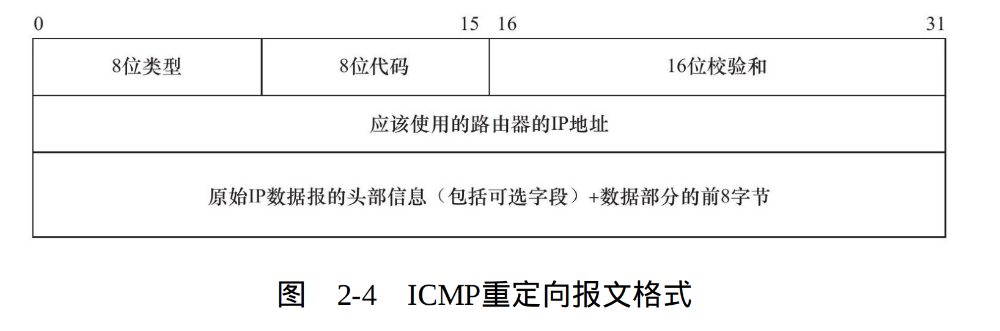
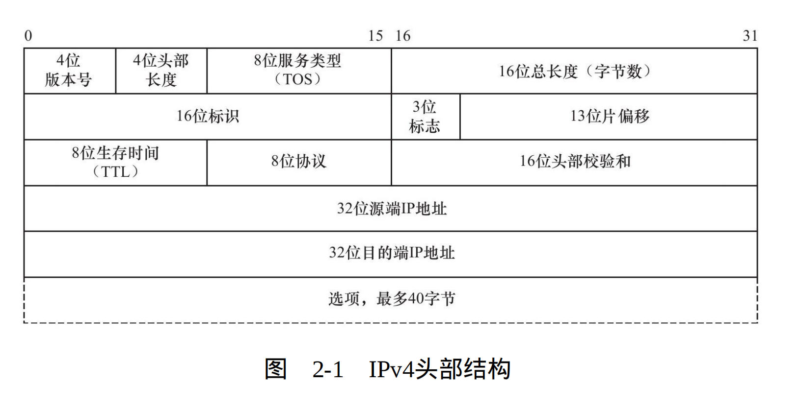
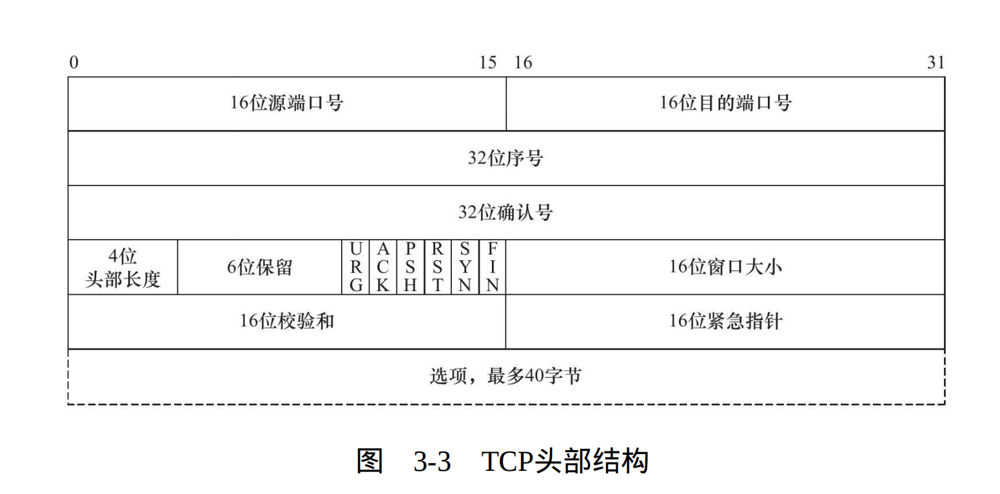
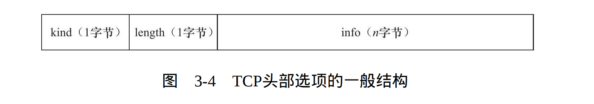
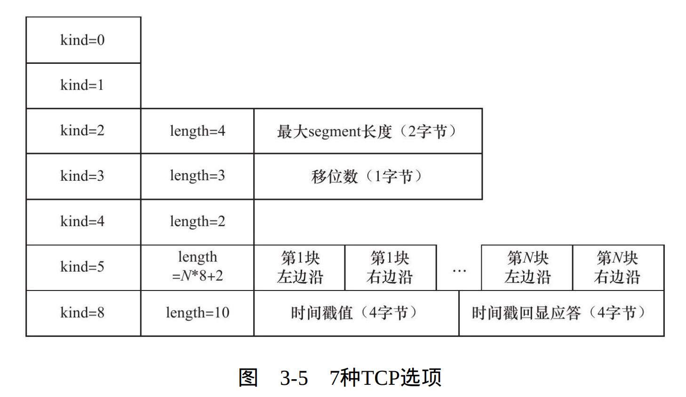

## 网络层

### 一.ICMP协议

#### 1. 8位类型
用于区分报文类型,它将ICMP报文分为两大类:**差错报文**和**查询报文**
##### 1.1 差错报文和查询报文
1. 差错报文主要用来回应网络错误 比如**目标不可达(类型值为3)** 和 **[重定向(类型值5)](#补icmp重定向报文)**
2. 查询报文主要用于查询网络信息 比如ping程序用于查询目标地址是否可达到
#### 2. 8位代码
用于进一步细分详细情况 例如代码值0表示对网络重定向 代码值1表示对主机重定向
#### 3. 16位校验和
16位校验和字段对整个报文进行冗余检验， 

#### 补：ICMP重定向报文:

### 二.IP协议
* **ipv4头部结构**：

#### 2.1 4位版本号(version)
用于指定ip协议版本,对于IPv4来说,其值为4。对于ipv4的其他拓展版本(例如SIP协议,和PIP协议),具有不同版本号和和头部结构

#### 2.2 4位头部长度(header length)
表示头部具有多少32bit字,因为4位最大值为15,所以IP头部最长为60字节

#### 2.3 8位服务类型(type of service,TOS)
* **3位优先字段**:已被忽略
* **4位TOS字段**:分别表示 最小延时,最大吞吐量,最高可靠性,最低费用
* **1位保留字段**:必须为0

#### 2.4 16位总长度
整个IP数据报的长度,受[MTU](常见英文缩写释义.md#数据链路层)限制,实际传输的IP数据报分片长度远不及最大值

#### 2.5 16位标识
1. **唯一标识**主机发送的每个数据报。
2. 初始值由系统生成,每发送一个数据报自增1
3. 对于一个数据报的所有分片,都具有相同的标识值

#### 2.6 3位标志
1. 第1位保留
2. 第2位表示禁止分片,如果设置了该位。若数据报长度超出MTU限制,IP模块将丢弃该报文,并返回一个ICMP差错报文
3. 第3位(More Fragment,MF)表示更多分片,除了数据报的最后一个分片,其余分片都要把它置为1

#### 2.7 13位片偏移
分片相对于原始数据报(数据部分)开始处的偏移量.实际值为该值左移(乘以8).故除最后一个分片以外,其余分片数据部分长度必须为8的倍数(这样其他分片才能有合适的偏移量.)

#### 2.8 8位生存时间(Time To Live,TTL)
数据报到达目的主机之前被允许的跳数,常用值为64。可防止数据报陷入路由循环。

#### 2.9 8位协议(protocol)
用于区分上层协议。ICMP为1,TCP为6,UDP为17。

#### 16位头部校验和
冗余检验

#### 选项
1. 记录路由:告诉数据报途径的所有路由器都将IP地址填入IP头部选项部分。
2. 时间戳:告诉每个路由器都将转发该数据报的时间填入IP头部选项部分。
3. 松散源路由选择：指定一个路由器ip地址列表,数据报发送途中必须经过列表中所有路由器
4. 严格源路由选择: 与上相似,但经过的路由只能是列表中包含的.

## 数据链路层

### 一.ARP协议

#### 1. 2字节硬件类型
定义硬件物理地址类型,类型值为1表示MAC地址
#### 2. 2字节协议类型
表示物理地址要映射的协议类型,类型值为0x800表示IPv4地址
#### 3. 1字节硬件地址长度和协议地址长度
分别表示硬件地址长度和协议地址长度,对MAC地址来说硬件地址长度为6字节,对IPv4来说协议地址长度为4字节
#### 4. 2字节操作
定义操作类型

|值|操作类型|
|--|-------|
|1|ARP请求|
|2|ARP应答|
|3|RARP请求|
|4|RARP应答|

## 应用层

### 一.DNS协议

#### 1. 16位标识字段:
用于标识一对DNS请求和应答,以便区分哪个DNS应答对应哪个DNS请求
#### 2. 16位标志字段:
* 16位标志字段细节:

* **QR字段**:请求/查询标志,**值为0**表示这是一个查询报文,**值为1**表示这是一个应答报文
* **opcode字段**: 定义查询和应答类型,**0**表示标准查询,**1**表示反向查询(由ip地址查询域名),**2**表示请求服务器状态
* **AA字段**:授权应答标志,仅有应答报文使用,1表示域名服务器为授权服务器
* **TC字段**:截断标志,仅当DNS使用UDP服务时,由于UDP数据报对长度有限制可能导致DNS报文被截断。1表示DNS报文长度超过512字节,并被截断
* **RD字段**:递归查询标志 1表示执行递归查询,当DNS服务器未能查询到目标资源,则向其他DNS服务器进行递归查询,直到查询并返回主机。 0标志执行迭代查询,DNS服务未能查询到目标资源,则将其他DNS服务器地址返回给客户端
* **RA字段**:允许递归标志,仅有应答报文使用,值为1表示DNS服务器支持递归查询
* **zero字段**:保留字段,必须填充0
* **rcode字段**:四位返回码,表示应答状态,常用值有0表示无错误·,3表示域名不存在

#### 3. 16位问题个数
对应查询问题数量。对于查询报文来说,至少为1

#### 4. 16位应答资源记录个数
对应响应的资源记录数量。对应答报文来说至少为1。对请求报文来说只能为0

#### 5. 16位授权资源记录数目
对应授权资源记录数量。对于1台DNS服务器,若不是某域名的权威服务器,则可能发起递归查询,对于该DNS服务器,权威服务器返回的资源为授权资源,该字段用于记录授权的资源记录数量.

#### 6. 16位额外的资源记录数目
对应额外信息记录数量。

#### 7. 查询问题
* **格式**:

* **查询名**:使用一定格式封装了要查询的主机域名
* **16位查询类型**:表示如何进行查询.

|类型|值|行为|
|----|---|---|
|A|1|表示获取主机IP地址|
|CNAME|5|表示获取主机的主机别名|
|PTR|12|表示获取主机的IP地址的域名(反向查询)|
* **16位查询类**:常用值为1,表示获取因特网地址.

#### 8.应答 授权 额外信息
* **格式**:都使用资源记录格式

* **32位域名**:某个资源记录对应的查询名.其格式与查询问题的查询名相同
* **16位类型与16位类**:同前
* **32位生存时间**:表示该查询结果能被本地客户端缓存多长时间
* **16位资源记录长度,资源数据**：取决于类型字段,若为A类型,则资源数据为32位ipv4地址,长度为4字节

## 传输层

### 一.TCP协议

#### 16位端口号
告诉主机该报文段来自哪个端口,以及传递给哪个上层协议或应用。客户端通常使用主机提供的临时客户端,服务器通常使用知名服务端口。

#### 32位序号
一次TCP通信中,某一个传输方向上的字节流每个字节的编号。例如:A和B主机进行TCP通信,A向B发送的第一个TCP报文段,序号之被系统初始化为ISN(initial sequence number,初始序号值)。后续报文段的序号值为ISN+该报文所携带数据的第一个字节在整个字节流中的偏移。

#### 32位确认号
用作对另一方发送来的TCP报文段的响应,其值为序号值+1。

#### 4位头部长度。
表示头部共有多少个32bit字,最长位60字节

#### 6位标志字段
* **URG:** 表示紧急指针是否有效。
* **ACK:** 表示确认号是否有效,携带ACK标志的TCP报文段被称为**确认报文段**
* **PSH:** 通知接收端应立即读取缓冲区中的数据,为后续数据接收提供足够空间。
* **RST:** 要求对方重新建立连接,携带RST标志的TCP报文段为**复位报文段**
* **SYN:** 请求建立TCP连接,携带SYN标志的TCP报文段为**同步报文段**
* **FIN:** 告诉对方本端要关闭连接了,携带FIN标志的报文段为**结束报文段**

#### 16位窗口大小
接收通告窗口(Receiver Window,RWND)。告诉对方本端接收缓冲区还能容纳多少字节。

#### 16位紧急指针
16位紧急指针（urgent pointer）：是一个正的偏移量。它和序号字段的值相加表示最后一个紧急数据的下一字节的序号。

#### 选项

* **常见TCP头部选项:**

* **kind = 0:** 选项表结束选项
* **kind = 1:** **空操作选项**。一般用于将TCP选项总长度填充为4字节整倍数。
* **kind = 2:** **最大报文段长度选项(MAX segment size,MSS)**。连接初始化时,双方用以商议定一个最大报文段长度。TCP模块通常将MSS设置为MTU-40字节(包括TCP固定头部和IP固定头部)
* **kind = 3:** **窗口扩大因子选项**。连接初始化时,通信双方商议一个窗口扩大因子。由于TCP头部的16位窗口大小最多只能表示65535字节,但TCP模块允许的接收窗口大小远超该数,窗口扩大因子用于解决该问题。 窗口扩大因子选项只出现在同步报文段中,同步报文段本身不执行窗口拓展。**实际窗口大小=窗口大小字段值左移N位(设拓展因子为N)**
* **kind = 4:** **选择性确认(selective acknowledgement)选项**。如果某个报文段丢失,TCP
会重从传最后一个被确认的报文段的后续所有报文段。这可能导致重复传送。SACK改善了该缺点,它只重传丢失的报文段。 该选项用于表示是否支持该技术,我们可以通改/proc/sys/net/ipv4/tcp_sack内核变量来启用或关闭选择性确认选项
* **kind = 5:** **SACK实际工作选项**。该选项的参数告诉发送放本端已经收到并缓存不连续的数据块,从而让发送端可以据此检查并重发丢失的数据块.
* **kind = 8:** **时间戳选项**。该选项提供了较为准确的计算通信双方之间的回路时间（Round Trip Time，RTT）的方法，从而为TCP流量控制提供重要信息。我们可以通过修改/proc/sys/net/ipv4/tcp_timestamps内核变量来启用或关闭时间戳选项