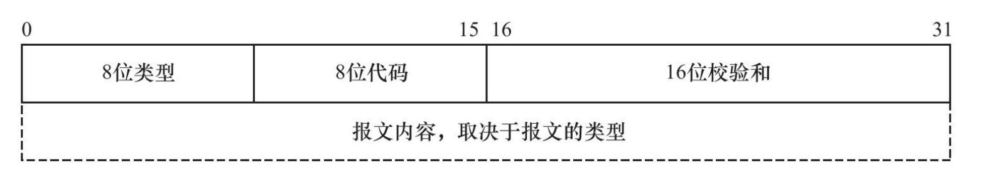

## 网络层

### 一.ICMP协议

#### 1. 8位类型
用于区分报文类型,它将ICMP报文分为两大类:**差错报文**和**查询报文**
##### 1.1 差错报文和查询报文
1. 差错报文主要用来回应网络错误 比如**目标不可达(类型值为3)** 和 **重定向(类型值5)**
2. 查询报文主要用于查询网络信息 比如ping程序用于查询目标地址是否可达到
#### 2 8位代码
用于进一步细分详细情况 例如代码值0表示对网络重定向 代码值1表示对主机重定向
#### 3. 16位校验和
16位校验和字段对整个报文进行冗余检验，以检查报文在传输过程中是否损坏

