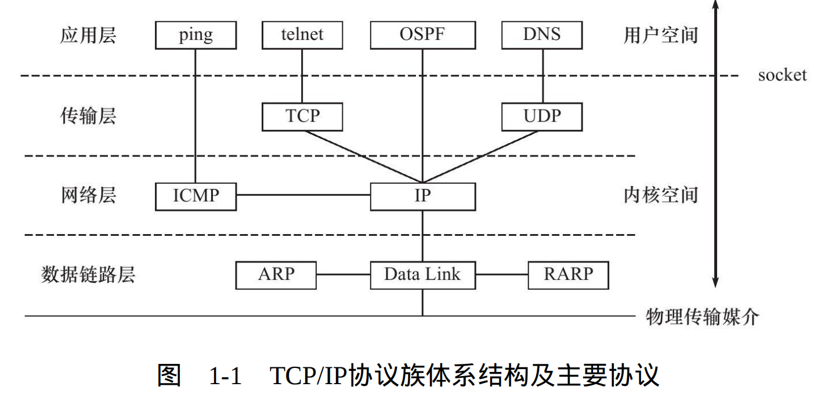

## 1.1 TCP/IP体系结构及主要协议

### TCP/IP协议族是一个如图所示的四层协议系统，每一层完成不同的功能，每层功能通过若干协议实现，
上层协议提供下层协议提供的服务

### 1.1.1 数据链路层
* 数据链路层实现了网卡接口的网络驱动程序，处理数据在物理媒介上的传输。
* 关键协议:**ARP协议** 数据链路层使用机器物理地址寻找一台主机，网络层使用ip地址寻找主机，网络层必须先使用
ARP协议将ip地址转换为机器物理地址才能调用数据链路层提供的服务

### 1.1.2 网络层
* 网络层实现分组的选路和转发
* 关键协议(1):**ip协议** 根据分组的目的ip地址,来决定分组的在分级路由中的投递或丢弃(使用逐跳的方式来确定通信路径)
* 关键协议(2):**ICMP协议** 主要检查网络连接

### 1.1.3 传输层
* 传输层封装实现了端到端的逻辑通信线路,它负责数据的收发和链路的超时重传
* 关键协议(1):**TCP协议**:TCP协议为应用层提供**可靠的,面向连接的,基于流的服务**
1. 可靠的：TCP协议使用数据确认,超时重传等方式保证数据正确的发送到目的端，因此TCP协议是可靠的
2. 面向连接的:使用TCP协议通信的双方必须建立连接,并在内核维持一些必要的数据结构(如连接状态,读写缓冲区,诸多定时器等)。并且通信结束后双方必须关闭连接以释放这些资源
3. 基于流的:基于流的数据没有边界(长度)限制,源源不断地从一端流向另一端,可随时向数据流写入数据,也可以随时从数据流中读取数据。
* 关键协议(2):**UDP协议**:UDP协议为应用层提供**不可靠的,无连接的,基于数据报的服务**。
1. 不可靠的:UDP协议不保证数据到达,也不保证数据到达的顺序。使用UDP协议通信的应用需要自己实现数据的完整性检查和重传机制。
2. 无连接:UDP协议不建立连接,即双方不保持长久练习,每次通信需要明确指定目的端地址
3. 基于数据报:基于数据报是相对于流,每个数据报都有一个长度,接收端必须要该长度为最小单位将数据一次读出,否则数据将会被截断
* 关键协议(3):SCTP协议：为了在因特网上传输电话信号而设计的
### 1.1.4 应用层
* 应用层主要负责程序的逻辑处理,一般工作在用户空间避免内核过于庞大。而其余三层为了高效稳定主要工作在内核空间。当然也存在为了性能而将引用曾编写在内核空间
* 主要协议如下：
1. OSPF协议：是一种动态路由更新协议，用于路由器之间的通信，以告知对方各自的路由信息
2. DNS协议:  提供机器域名到IP地址的转换
* 应用层协议(或程序)可直接跳过传输层使用网络层协议(例如ping程序),可以通过etc/services文件查看所有知名的应用层协议

