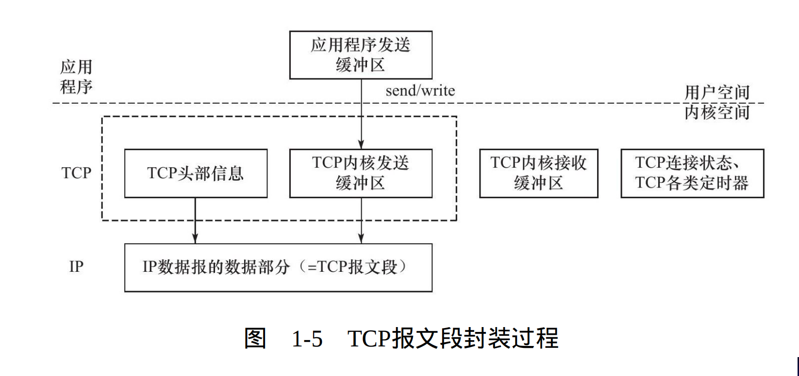

## 1.2 封装
Q:上层协议如何使用下层协议提供的服务

A:通过封装(encapsulation)实现的

**基本概念**:数据在发送到物理网络上之前,将沿着协议栈向下,每层协议在上层数据基础上依次加上自己的头部信息(有时包括尾部信息),用于实现该层功能,这个过程被称为**封装**

### 1.2.1.1 TCP报文段

* **基本概念**：经过TCP封装后的数据称为TCP报文段(TCP message segment)。
* **组成**: 由TCP头部信息和TCP内核缓冲区(收发缓冲区,不包括为连接维持的其他内核数据结构)组成
* **封装过程**:

1. 应用程序发送数据(调用send/write函数)
2. TCP模块将数据复制到TCP内核发送缓冲区
3. TCP模块调用IP模块服务,传递参数包括TCP头部信息和内核发送缓冲区中的数据,即TCP报文段

### 1.2.1.2 UDP数据报
* **基本概念**: 经过UDP封装后的数据称为UDP数据报(UDP datagram)
* **组成** :由UDP头部信息和UDP内核缓冲区组成
* **封装过程**: 与TCP类似,不过UDP不必为应用层保存副本,当UDP数据报被发送后,UDP内核缓冲区中的该数据报就会被丢弃。若需要重新发送,则需要将用户空间中的数据再次拷贝到内核中

### 1.2.2 IP数据报
* **基本概念** :经过IP封装后的数据称为IP数据报(IP datagram)
* **组成** :由IP头部信息和数据部分组成,IP数据的数据部分就是一个TCP报文段,UDP数据报或者ICMP报文

### 1.2.3 帧
* **基本概念** :经过数据链路层封装后的数据称为帧(frame)
* **格式**:不同物理媒介的帧类型不同(以太网传输以太网帧[ethernet frame],令牌环传输令牌环帧[token ring frame]) 以以太网帧为例:

* **MTU**:帧的最大传输单元,即帧最多能携带多少上层协议数据(比如IP数据报的),通常受到网络类型的限制,以太网帧的MTU为1500字节,过长的IP数据报可能会被分片传输
* 帧才是物理网络上传输的最终字节序,至此,封装过程完成

