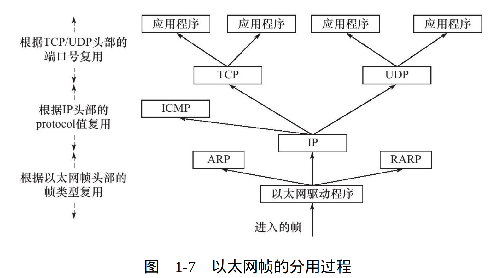

## 1.3 分用

* **基本概念**:当帧到达目的主机后沿着协议栈向上,各层协议以此处理对应头部信息,以获取所需要的信息,最后将处理后的帧交给应用程序,这个过程为称为分用(demultiplexing)
#### Q:各层协议如何判断自身对应的头部信息
#### A:分用依靠头部类型字段(标准文档RFC 1700定义了所有标识上层协议的类型字段以及每个上层协议对应的数值)
  
* **过程**:

1. 以以太网帧为例:由于ARP,IP,RARP都使用帧传输,为不混淆,以太网帧提供**类型字段**([参见以太网帧格式](1.2_封装.md#ethernet_frame))对上层协议进行区分

|类型字段值|对应协议类型|交付的模块|
|---------|-----------|---------|
|0x800|IP数据报|IP模块|
|0x806|ARP请求或应答报文|ARP模块|
|0x835|RAR请求或应答报文|RARP模块|

2. 若为IP数据报,同理,IP数据报也会采用**16位协议(protocol)字段值** 对上层协议进行区分
3. 若为TCP报文段或UDP数据报,同理,采用**16位端口号(port number)** 来对上层应用进行区分,在etc/services文件中可以找到各知名应用的端口号
4. 通过上述步骤后,最终将封装的前的原始数据送至目标服务,最终在顶层应用开来,封装和分用就没有发生过
