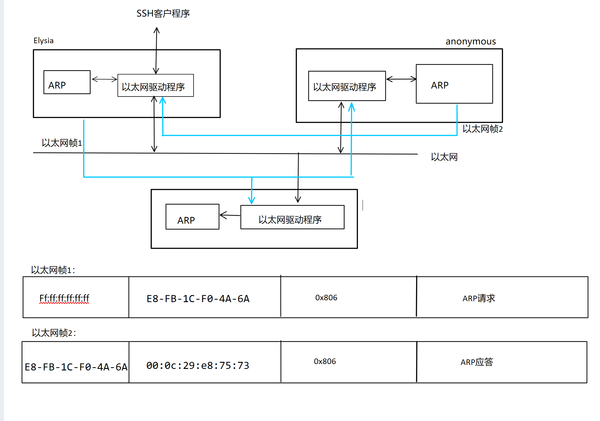

## 1.4 ARP协议工作原理

[**ARP协议报文格式**](../常见协议报文格式及解析.md#一arp协议)

由此可见,一个ARP报文的长度为28字节,加上以太网帧的头部和尾部(18字节),一个ARP报文的以太网帧长度为46字节,不过有的实现要求以太网帧的数据部分至少为46字节,这时ARP报文会填充一些字节满足需求,这样的ARP报文帧长度为64字节
### 1.5.1 步骤(ARP协议能实现任意网络层地址到物理地址的转换,这里以MAC地址为例)：

1. 封装ARP请求报文
* ARP模块将硬件类型字段填充为1,表示使用MAC地址进行转换。
* 将协议类型字段填充为0x800表示使用IPv4地址映射到MAC地址。
* 填充硬件地址长度和协议地址长度
* 填充操作码字段为1 表示ARP请求操作
* 填充源端以太网地址和源端IP地址(发送端)
* 填充目的ipv4地址
2. 广播ARP请求
* 发送端主机向所在网络广播一个ARP请求,在该网络的所有主机都能接收到该请求,<span id=1>**但只有目标主机**</span>会对该请求做出响应
3. 目标主机响应ARP请求
* 目标主机将自己的MAC地址填入源端以太网地址,并将之前源端的主机的地址填入目的端。并将响应报文发送给目的端
4. 最初源端主机获得响应报文并得到目的端MAC地址


### 1.5.2 ARP高速缓存的查看和修改

[**查看测试网络**](../测试网络.md#测试网络)

**查看ARP高速缓存**:在Linux上执行arp-a命令
``````shell
[kevin@anonymous ~]$ arp -a
elysia (192.168.1.9) at e8:fb:1c:f0:4a:6a [ether] on ens33
? (192.168.1.1) at cc:5c:de:d8:f6:c8 [ether] on ens33
``````
* 第一项描述的是测试网络的主机2 的ip地址和mac地址等信息(与测试网络给出的配置相同)
* ? (192.168.1.1) 是我们的测试路由

**删除与添加**:
``````shell
$sudo arp-d 192.168.1.9 #删除elysia对应的arp缓存项
$sudo arp-s 192.168.1.9 E8-FB-1C-F0-4A-6A #添加elysia对应的ARP缓存项
``````

### 1.5.3 使用tcpdump观察ARP通信过程
#### 操作步骤如下:
1. 在anonymous主机的操作
``````shell
sudo tcpdump -i ens33 'arp and ((src host 192.168.1.14 and dst host 192.168.1.9) or (src host 192.168.1.9 and dst host 192.168.1.14))'
``````
2. 在elysia主机的操作
``````shell
ssh kevin@192.168.1.14 #使用ssh远程登录anonymous主机的Kevin用户
``````
3. 查看输出信息
``````shell
15:56:26.541215 e8:fb:1c:f0:4a:6a (oui Unknown) > Broadcast, ethertype ARP (0x0806), length 60: Request who-has anonymous tell elysia, length 46

15:56:26.541270 00:0c:29:e8:75:73 (oui Unknown) > e8:fb:1c:f0:4a:6a (oui Unknown), ethertype ARP (0x0806), length 42: Reply anonymous is-at 00:0c:29:e8:75:73 (oui Unknown), length 28
``````
1. **第一行**:
* 15:56:26.541215 是数据包被捕获的时间戳。
* e8:fb:1c:f0:4a:6a 是发送ARP请求的设备的MAC地址(即elysia)。
* (oui Unknown) 表示制造商的组织唯一标识符（OUI）未知，无法识别制造商。
* \> Broadcast 表示这是一个广播消息，发送给网络上所有设备。(广播地址为ff:ff:ff:ff:ff:ff)
* ethertype ARP (0x0806) 指明了以太网帧的类型是ARP。
* length 60 是以太网帧的长度(实际为64,tcpdump没统计以太网帧尾部的4字节CRC)。
* Request who-has anonymous tell elysia 是ARP请求的内容，询问谁拥有anonymous的IP地址，请告诉elysia(这里的主机名指代ip地址) 
等价于 Request who-has 192.168.1.14 tell 192.168.1.9 即谁拥有192.168.1.14这个ip地址,请把你的MAC地址告诉ip地址为192.168.1.9的主机
* length 46 是ARP请求数据部分的长度。
1. **第二行**:
* 15:56:26.541270 是回复数据包的时间戳，紧接着请求之后。
* 00:0c:29:e8:75:73 是回复ARP请求的设备的MAC地址。
* \> e8:fb:1c:f0:4a:6a 指明了这个回复是发送给请求方的MAC地址。
* ethertype ARP (0x0806) 同样表明这是一个ARP帧。
* length 42 是以太网帧的长度(实际46)。
* Reply anonymous is-at 00:0c:29:e8:75:73 是ARP回复的内容，意思是拥有anonymous IP地址的设备的MAC地址是00:0c:29:e8:75:73”。
* length 28 是ARP回复数据部分的长度。

**用图理解**：


1. 两次通信的以太网帧内容按照以[太网帧格式图](1.2_封装.md#ethernet_frame)画出
2. ARP请求和应答实际由以太网驱动程序发出(黑线),并非像图中那样直接由ARP模块发送到以太网(蓝线),以体现携带ARP数据的以太网帧与携带其他数据报的以太网帧的区别
3. 路由器当然也接收到了第一个广播帧,显然路由器并未做出回应,[正如前文所说的那样](#1)
