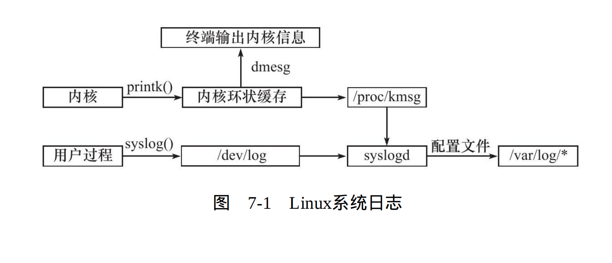

## 7.1 日志

### 7.1.1 linux系统日志
Linux提供一个守护进程来处理系统日志——syslogd，不
过现在的Linux系统上使用的都是它的升级版——rsyslogd


用户进程通过调用syslog()函数来生成系统日志。该函数将日志输
出到一个UNIX本地域socket类型（AF_UNIX）的文件/dev/log中

syslogd守护进程在接收到用户进程或内核输入的日志后，会把它
们输出至某些特定的日志文件。默认情况下:
* 调试信息会保存至/var/log/debug文件。
* 普通信息保存至/var/log/messages文件。
* 内核消息则保存至/var/log/kern.log文件。
* 不过，日志信息具体如何分发，可以
在rsyslogd的配置文件中设置。rsyslogd的主配置文件
是/etc/rsyslog.conf，其中主要可以设置的项包括：内核日志输入路径，
是否接收UDP日志及其监听端口（默认是514，见/etc/services文件），
是否接收TCP日志及其监听端口，日志文件的权限，包含哪些子配置文
件（比如/etc/rsyslog.d/*.conf）。rsyslogd的子配置文件则指定各类日志
的目标存储文件。

**Linux系统日志体系:**


### 7.1.2 syslog函数

**定义:**
``````C++
#include<syslog.h>
int syslog(int priority, const char *message, ...);
``````

**参数:**
* 该函数使用可变参数来实现结构化输出
* priority: 设施值与日志级别的按位或,设施值默认LOG_USER。日志级别如下:
``````C++
#include<syslog.h>
#define LOG_EMERG 0 //系统不可用
#define LOG_ALERT 1 //报警 需要立即采取动作
#define LOG_CRIT 2  //非常严重的情况
#define LOG_ERR 3   //错误
#define LOG_WARNING 4 //警告
#define LOG_NOTICE 5 //通知
#define LOG_INFO 6 //信息
#define LOG_DEBUG 7 //调试
```````

下面这个函数可改变syslog的默认输出方式,进一步结构化日志:

**定义:**
``````C++
#include<syslog.h>
void openlog(const char *ident, int option, int facility);
``````
* ident: 该参数指定的字符串将被添加到日志信息的日期和时间之后,通常时程序的名字。
* option参数对后续syslog配置进行配置,它可取下列值的按位或

``````C++
#include<syslog.h>
#define LOG_PID 0x01 //将进程ID添加到日志信息中
#define LOG_CONS 0x02 //如果日志不能打印到文件,将日志信息输出到控制台
#define LOG_NDELAY 0x04 //不延迟打开日志功能
#define LOG_ODELAY 0x08 //延迟打开日志功能,直到第一调用syslog()
``````

* facility参数可用来修改syslog函数中的默认设施值。

此外，日志的过滤也很重要。程序在开发阶段可能需要输出很多
调试信息，而发布之后我们又需要将这些调试信息关闭。解决这个问
题的方法并不是在程序发布之后删除调试代码（因为日后可能还需要
用到），而是简单地设置日志掩码，使日志级别大于日志掩码的日志
信息被系统忽略。下面这个函数用于设置syslog的日志掩码：
``````C++
#include<syslog.h>
void setlogmask(int mask);
``````
* mask: 掩码值
* 返回值: 该函数始终调用成功,返回调用进程先前的掩码值

最后，不要忘了使用如下函数关闭日志功能：
``````C++
#include<syslog.h>
void closelog();
``````
