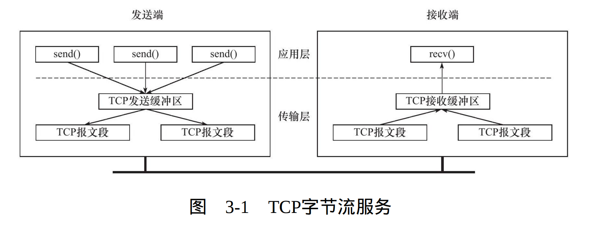
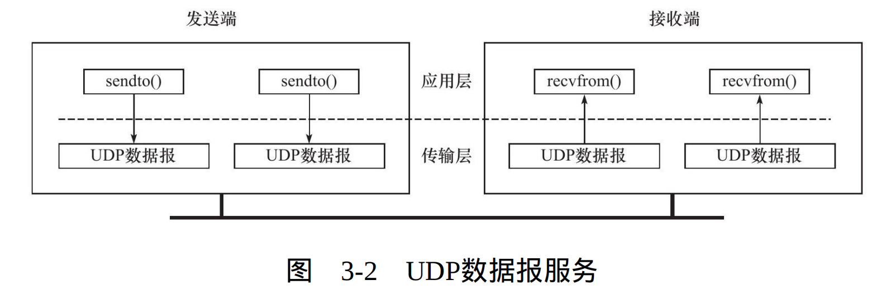

## 3.1 TCP服务的特点

**本章将从以下四个方面介绍TCP协议:**

* **TCP头部信息:** 出现在每个TCP报文段中,用于指定源端和目的端IP地址,管理连接状态和控制数据流
* **TCP状态转移:** TCP连接的任意一端都是一个状态机。从TCP连接建立到断开的整个过程中,两端状态机都将经历不同状态变迁
* **TCP数据流:** 通过分析TCP数据流,我们可以从网络应用程序外部来了解应用层协议和通信双方交换的应用程序数据。这里将介绍**交互数据流**,**成块数据流**以及特殊的**紧急数据**
* **TCP数据流的控制:** 这里将讨论**超时重传**和**拥塞控制**

**TCP特点:**

* 使用TCP协议通信双方必须建立TCP连接,随后开始读写
* 内核必须为其维持一定数据结构,来管理连接和连接上的数据传输
* TCP连接是全双工的,双方可以通过一个连接进行数据读写,结束后双方都要关闭连接。
* TCP协议是1对1的,所以不适用于广播或多播的应用程序。而无连接的UDP则非常使用于广播或多播。
* TCP采用发送应答机制,即每个TCP报文段必须得到接收端应答才算发送成功
* TCP采用超时重传机制,发送端在发出一个TCP报文段之后启动定时器,若在定时间内未得到回答,它将重传该TCP报文段
* TCP会将报文段重排,整理后再交付给应用层
  

**基于流和基于数据报的简单对比:**

* **基于流:** 
1. 当发送端进行多次写操作时,TCP模块先将这些数据放入TCP发送缓冲区中,当TCP模块真正开始发送数据时,可能将这些数据封装为1个或多个TCP报文端,因此**TCP模块发送的报文段个数与应用程序执行写操作的次数无关**
2. 当接收端接收到一个或多个TCP报文段时,TCP模块将它们携带的应用程序数据按照TCP报文段序号依次放入TCP接收缓冲区中。应用程序可以一次读取,也可分多次读取,这取决于应用程序的缓冲区大小。因此**应用程序执行读操作的次数与TCP模块接收到的报文段数量无关**。

* **基于数据报:**
1. 发送端每执行一次写操作,UDP模块据将其封装为UDP数据报并发送之,**接收端必须针对每个UDP数据报进行读操作**,否则就会丢包。并且如果接收端未提供足够的缓冲区,UDP数据报将被截断

**下图展示了TCP字节流服务和UDP数据报服务上述区别:**

