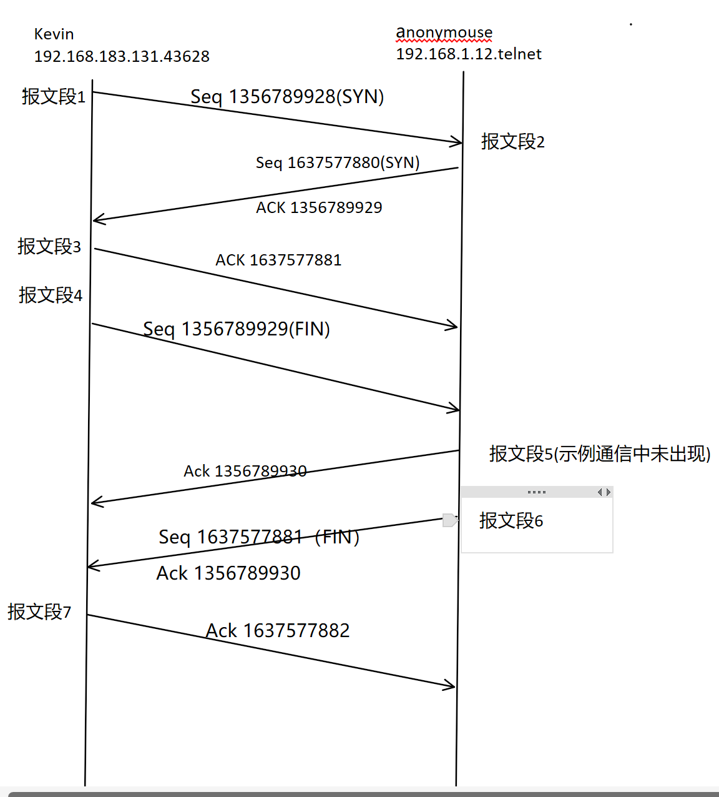
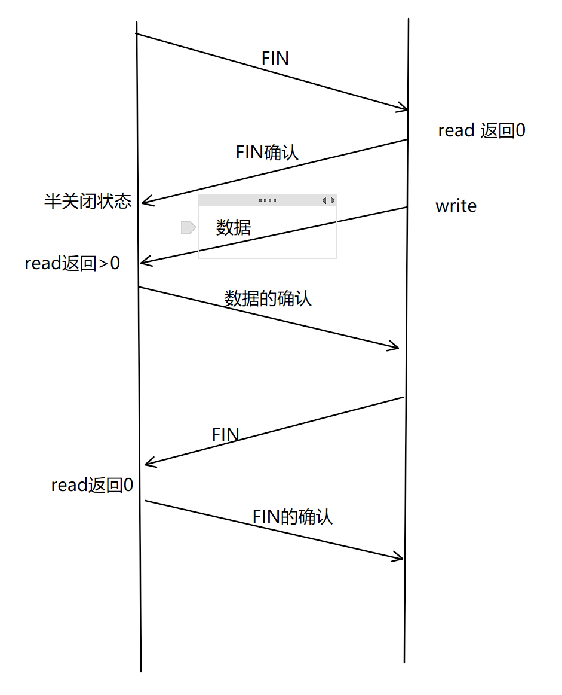

## 3.3 TCP连接的建立与关闭

### 3.3.1 使用tcpdump观察TCP连接的建立和关闭
``````shell
$ sudo sudo tcpdump -i ens33 -nt '(src 192.168.183.131 and dst 192.168.1.12) or (src 192.168.1.12 and dst 192.168.183.131)' #在kevin监听和anonymouse主机的通信
$ telnet 192.168.1.12 #在kevin上使用telnet远程登录anonymouse主机
Trying 192.168.1.12...
Connected to 192.168.1.12.
Escape character is'^]'.
^]（回车）#输入ctrl+]并回车
telnet＞quit（回车）
Connection closed
``````
* **查看输出:**
``````shell
1. IP 192.168.183.131.43628 > 192.168.1.12.23: Flags [S], seq 1356789928, win 64240, options [mss 1460,sackOK,TS val 411044669 ecr 0,nop,wscale 7], length 0
2. IP 192.168.1.12.23 > 192.168.183.131.43628: Flags [S.], seq 1637577880, ack 1356789929, win 64240, options [mss 1460], length 0
3. IP 192.168.183.131.43628 > 192.168.1.12.23: Flags [.], ack 1, win 64240, length 0
4. IP 192.168.1.12.23 > 192.168.183.131.43628: Flags [FP.], seq 1, ack 1, win 64240, length 0
5. IP 192.168.183.131.43628 > 192.168.1.12.23: Flags [F.], seq 1, ack 2, win 64056, length 0
6. IP 192.168.1.12.23 > 192.168.183.131.43628: Flags [.], ack 2, win 64239, length 0
``````

**用图来解释该TCP连接建立和关闭的过程:**


* **报文段1:** 第一个TCP报文段包含SYN标志,为同步报文段,它向anonymous发起连接请求。同时,它的ISN值为1356789928
* **报文段2:** 第二个TCP报文段也为同步报文段,它表示同意和kevin建立连接,并发送字节的ISN值1637577880。确认号为1356789929,即对方报文段序号值+1.
* **报文段3:** 从该报文段开始,tcdump输出的序号值和确认值都是相对于ISN值的偏移量。seq值无变化,因为序号值是ISN+该报文携带的数据的第一个字节在字节流中的偏移量,由于现在处于建立连接截断,该报文段没携带任何应用层数据 **(同步报文段和结束报文段即使不携带任何数据,它也占用一个序号值)**。

**至此TCP连接建立完成,建立TCP连接的以上三步骤被称为<span style="color: red">TCP三次握手</span>**

* **报文段4:** 该报文段是结束报文段,因为它携带一个FIN标志。
* **报文段5:** anonymous用该报文段来确认报文段4的到达(实际上,该报文段是可省略的,因为报文段6也携带对报文段4的确认值,是否出现该报文段取决于TCP的延迟确认特性)
* **报文段6:** 结束报文段,并且也携带对上一个对方报文段到达的确认。
* **报文段7:** kevin用该报文段来确认报文段6的到达。
 
**至此TCP连接关闭,关闭TCP连接的以上四步骤被称为<span style="color: red;">TCP四次挥手</span>**

**补:** 
1. 主动关闭:在此实例中,由于kevin先发送结束报文段,所以kevin是主动关闭
2. 被动关闭:同理,anonymouse为被动关闭.

### 3.3.2 半关闭状态
TCP连接是全双工的,它允许两个方向的某个数据传输被单独的关闭。当通信发送完所有TCP报文段后,向另一方发送结束报文段,告诉对方已发送完所有报文段,但允许继续接收来自对方的数据,直到对方发送结束报文段以关闭连接,我们将此状态称为**半关闭状态**



**应用程序判断对方是否半关闭的方法是系统调用read返回0**

### 3.3.3 连接超时

* 在anonymous主机上执行如下命令:
``````shell
$ sudo iptables -F #清空iptables规则
$ sudo iptables -I INPUT -p tcp --syn -i ens33 -j DROP #插入规则,拦截TCP同步报文段
``````
用这种方式,我们能模拟服务器忙碌环境

* 在kevin主机上执行如下命令:
``````shell
$ sudo tcpdump -n -i ens33 port 23
$ date;telnet anonymouse;date #在telnet前后执行date命令,以计算超时时间
``````
* 查看输出
``````shell
10:47:57.937188 IP 192.168.183.131.54106 > 192.168.1.12.23: Flags [S], seq 3337916304, win 64240, options [mss 1460,sackOK,TS val 420850459 ecr 0,nop,wscale 7], length 0

10:47:58.938327 IP 192.168.183.131.54106 > 192.168.1.12.23: Flags [S], seq 3337916304, win 64240, options [mss 1460,sackOK,TS val 420851460 ecr 0,nop,wscale 7], length 0

10:48:00.953828 IP 192.168.183.131.54106 > 192.168.1.12.23: Flags [S], seq 3337916304, win 64240, options [mss 1460,sackOK,TS val 420853476 ecr 0,nop,wscale 7], length 0

10:48:05.146297 IP 192.168.183.131.54106 > 192.168.1.12.23: Flags [S], seq 3337916304, win 64240, options [mss 1460,sackOK,TS val 420857668 ecr 0,nop,wscale 7], length 0

10:48:13.338128 IP 192.168.183.131.54106 > 192.168.1.12.23: Flags [S], seq 3337916304, win 64240, options [mss 1460,sackOK,TS val 420865860 ecr 0,nop,wscale 7], length 0

10:48:18.971047 IP 192.168.1.12.23 > 192.168.183.131.54106: Flags [R.], seq 711741693, ack 3337916305, win 64240, length 0
``````
* 分析
1. **重连间隔时间：** 可以看到前5个报文段都是同步报文段,并且有相同的seq和ack值,说明后4个报文段是超时重连报文段。它们的时间间隔分别为1,2,4,8s。这由/proc/sys/net/ipv4/tcp_syn_retries内核变量定义,每次重连的超时
时间都增加一倍。
2. **停止重连:** 同样,重连的次数由/proc/sys/net/ipv4/tcp_syn_retries内核变量定义,默认值为6,当重连次数达到6次时,系统会停止重连。 在这里kevin收到了anonymous的复位报文段,于是kevin停止了重连。
   