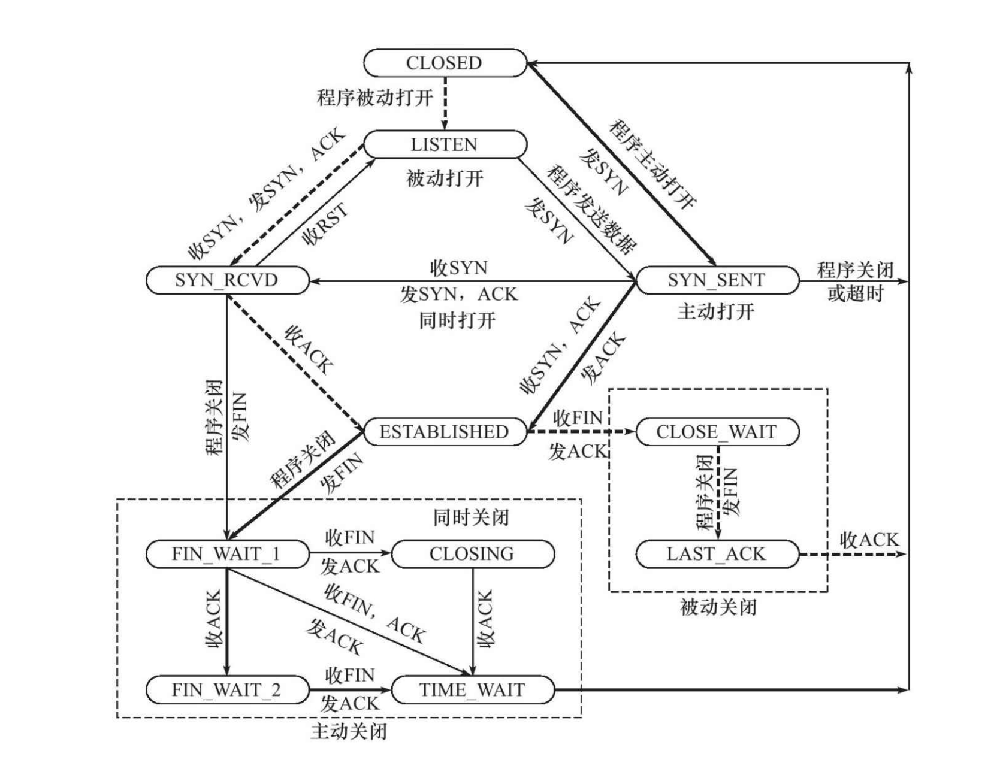
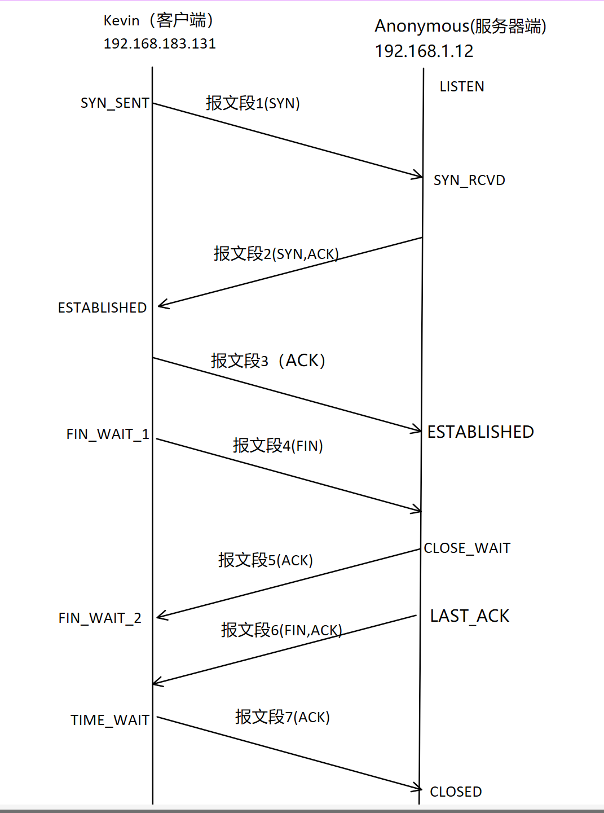

## 3.4 TCP状态转移
TCP通信的任意一端的任意时刻都处于某种状态,使用netstat命令可查看当前状态。

### 3.4.1 TCP状态转移总图

**注:** 粗虚线是典型的服务器端连接状态转移。粗实线是典型的客户端连接状态转移。CLOSED是一个假想的起点,并非一个实际状态。

**典型服务器端状态转移解析:**

1. 当服务器端进行listen系统调用,进入**LISTEN状态**,将会被动打开
2. 此时服务器若接收到连接请求(同步报文段),就会将该连接放入内核等待对立,并且回应一个带SYN标志的确认报文端。此时该连接处于**SYN_RCVD状态**.
3. 此时若服务器端接受到来自客户端的确认报文段,此时该连接处于**ESTABLISHED状态**
4. 若此时接受到来自客户端的结束报文段(FIN标志),并且回应确认报文段,此时该连接进入**CLOSE_WAIT状态**。该状态含义明确:等待服务器端应用程序关闭连接。
5. 若此时服务器向客户端发送结束报文段,此时该连接处于**LAST_ACK状态**,等待客户端的最后以此确认。
6. 收到客户端的确认报文段后,此时连接关闭

**典型客户端状态转移解析:**
1. 当客户端进行connect系统调用,程序将主动打开,此时向服务器端发送同步报文段后,该连接处于**SYN_SENT状态**。
2. 此时若收到服务器端发来的带SYN标志的确认报文段,并且回应一个确认报文端后,该连接处于**ESTABLISHED状态**
3. 此时客户端向服务器发送FIN标志的结束报文段,此时该连接处于**FIN_WAIT_1状态**
4. 若此时收到服务器端的确认报文段,该连接处于**FIN_WAIT_2状态**
5. 此时若收到来自服务器端的结束报文段,并且回应确认报文段后。该连接处于**TIME_WAIT状态**

**对应TCP连接时序图的状态转移:**

### 3.4.2 TIME_WAIT状态
在该状态下,客户端连接需要等待2MSL(最大段生存时间,Maximum Segment Life)后才能进入CLOSED状态。

**TIEM_WAIT存在的原因:**
* 可靠的终止TCP连接
* 保证让迟来的报文段有足够的时间被识别并丢弃

**对原因的解析:**

1. 若在服务器端向客户端发送结束报文段后(时序图中报文段6),若此时客户端向服务器端回应的确认报文段(报文段7)没有被服务器接收,服务器则会重发结束报文段。而客户端必须停留在某种状态以回应这些重复的报文段。否则客户端将会向服务器发送复位报文段,而这会导致服务器报错,因为它期待的是像报文段7一样的确认报文段。
2. 在Linux上,一个TCP端口不能被同时打开多次,当一个TCP连接处于TIME_WAIT状态,我们将无法使用该连接占用的端口建立新连接。 换言之,若不存在该状态,应用程序可以立即建立一个和刚关闭的连接相似连接(指拥有相同的IP地址和端口号)。这个相似的连接被称作**原来的连接的化身(incarnation)**,这个化身可能会收到原来连接的报文段。
3. 因为TCP报文段的最大生存时间是MSL，所以坚持2MSL时
间的TIME_WAIT状态能够确保网络上两个传输方向上尚未被接收到
的、迟到的TCP报文段都已经消失（被中转路由器丢弃）。因此，一个
连接的新的化身可以在2MSL时间之后安全地建立

