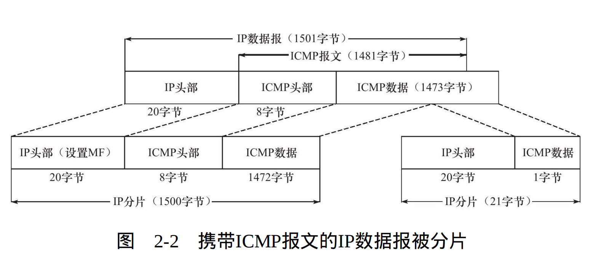

## 2.3 IP分片

**基本概念:** 
* 当数据报长度超过MTU限制,它将被分片传输。
* 分片可能会发生在除目标机器的所有路由或主机上。
* 分片只会在目标主机的IP模块上被重组。
* IP头部提供 "标识字段","标志字段","片偏移"
* 每个分片都具有IP头部,具有同标识值,不同的片偏移,并且除最后一个分片都设置**MF标志**。
  
### 2.3.1 使用ICMP示例IP分片
* **场景**：以太网帧的MTU是1500(使用ifconfig命令查看)。因此IP数据报的数据部分至多携带1480字节数据(IP头部占20字节)。考虑IP数据报携带一个1481字节的ICMP报文(ICMP报文头部占8字节,所以数据部分为1473字节)。则该IP数据报在传输时必须被分片,如图:



**解析:**
* 长度为1501字节的IP数据报被分片,第一个分片为1500字节,第二个分片为21字节,以满足MTU限制
* 每个分片都具有IP头部,用于根据IP头部中的三个字段对IP分片进行冲
* ICMP数据报头部并没有复制在每个分片中,因为IP模块重组IP数据报时只需要一份ICMP报文头部。
* 第一个分片设置了MF标志,第二个没有,因为它已经是最后一个分片

**注:**ICMP报文的头部长度取决于报文的类型，其变化范围很大

### 2.3.2 使用tcpdump观察IP分片
**在anonymous主机上执行:**
``````shell
$sudo tcpdump -ntv -i ens33 icmp
$ping elysia -s 1473 #在anonymous上ping  elysia主机,-s 1473指定发送1473字节数据
``````

**查看输出：**
``````shell
IP (tos 0x0, ttl 128, id 47628, offset 0, flags [+], proto ICMP (1), length 1500)
    192.168.1.10 > 192.168.1.12: ICMP echo reply, id 33705, seq 1, length 1480
IP (tos 0x0, ttl 128, id 47628, offset 1480, flags [none], proto ICMP (1), length 21)
``````

**解析:** 
* IP: 指出后面为IP数据报
* tos: 0x0 4位tos字段,表示未设置任何特殊服务
* ttl: 生存时间,这里为128跳
* id: 标识字段,可以看出两个IP分片具有相同的标识
* offset:片偏移,第一个为0,第二个为14801,很显然,第二个分片的偏移就是ICMP报文长度
* flags[+]: 设置了MF标志,表示有更多分片
* flags[none]: 未设置MF标志,表示后续没有分片,因为这是最后一个分片 
* porto ICMP(1): 协议字段,表示上层数据报为ICMP报文
* length: IP分片长度,第一个为1500,第二个为21。至此,该实验都与2.3.1的描述的一致

