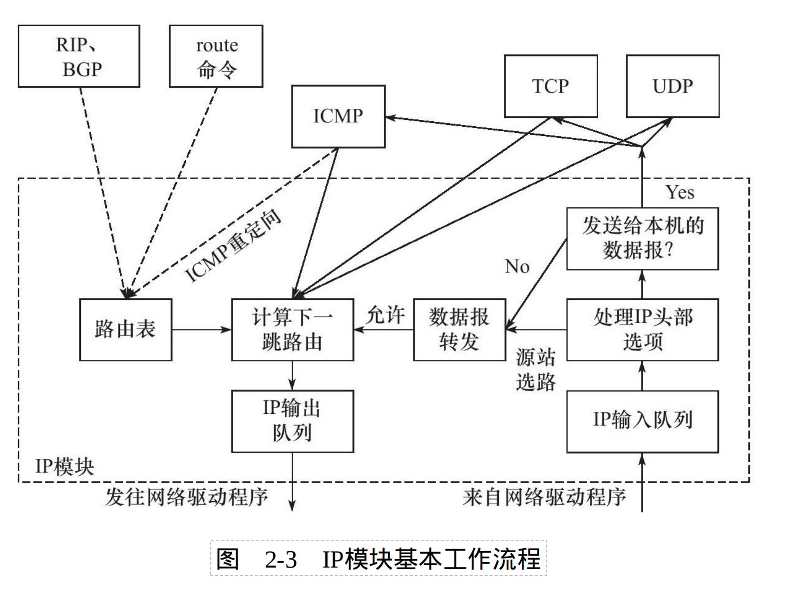

## 2.4 IP路由
* **基本概念:** IP协议的一共核心任务就是数据报的路由,即决定数据报转发到目标机器的路径

### 2.4.1 IP模块工作流程


* **解析:**
1. 从右向左分析此图
2. IP模块收到来自数据链路层的IP数据报,它首先对其头部做CRC校验,确保头部无损后分析头部信息
3. 若该IP数据报设置了源站路由选项(松散源路由,严格源路由),则IP模块调用数据报转发子模块来处理该数据报
4. 若该IP数据报的目地IP地址为本机的某个IP地址或广播地址,则IP模块根据协议字段来辨别发送给上层哪个协议
5. 若目的IP地址不为本机,IP模块也调用数据报转发子模块来处理该数据报
6. 数据报转发子模块检测本机是否允许转发。若不允许,则丢弃该数据报。若允许,则将该数据报送入IP数据报输出子模块
7. IP数据报发送至哪个下一跳路由,以及从哪个网卡发送,就是IP路由过程。即图中"计算下一跳路由"子模块。实现该功能的关键数据结构就是路由表
8. IP输出队列中存放的都是等待发送的IP数据报
9. 虚线部分展示了路由表更新的过程,该部分就通过协议或route命令来调整路由表,以适应网络最新的拓扑结构,我们称之为**IP路由策略**

### 2.4.2 路由机制

* **路由表实例:**
``````shell
$route -n
Destination     Gateway         Genmask         Flags Metric Ref    Use Iface
0.0.0.0         192.168.1.1     0.0.0.0         UG    100    0        0 ens33
192.168.1.0     0.0.0.0         255.255.255.0   U     100    0        0 ens33
``````

<table border="1">
  <tr>
    <th rowspan="2">字段</th>
  </tr>
  <tr>
    <th>含义</th>
  </tr>
  <tr>
    <td>Destination</td>
    <td>目标主机或网络,0.0.0.0表示默认路由</td>
  </tr>
  <tr>
    <td>Gateway</td>
    <td>网关地址</td>
  </tr>
  <tr>
    <td>Genmask</td>
    <td>网络掩码</td>
  </tr>
  <tr>
    <td>Flags</td>
    <td>
      路由项标志，常见的有：<br>
      U, 路由项当前是活动的；<br>
      H, 路由项的目的地是一台主机；<br>
      G, 路由项的目的地是网关；<br>
      D, 路由项是由重定向生成的；<br>
      M, 路由项被修改过的路由
    </td>
  </tr>
  <tr>
    <td>Metric</td>
    <td>网络距离,到达指定网络需要的中转数</td>
  </tr>
  <tr>
    <td>Ref</td>
    <td>路由项引用的次数（Linux未使用）</td>
  </tr>
  <tr>
    <td>Use</td>
    <td>这路项被使用的次数</td>
  </tr>
  <tr>
    <td>Iface</td>
    <td>这路项对应的网络接口</td>
  </tr>
</table>

* **解析:**
1. 第一项目标地址为0.0.0.0,即默认路由,该项包含一个G标志,表示目标地址是一个网关,其地址是192.168.1.1(测试网络中路由的IP地址)
2. 第二项目标地址为192.168.1.0,它是本地局域网,该网关为0.0.0.0表示,说明数据报不需要中转就能到达目标网络

* **路由机制的3个步骤:**

路由器依靠以下三个步骤,将IP地址分类。或给定数据报的目标IP地址,匹配路由表中的某一项。

1. 查找路由表中和数据报中目标IP地址完全相同的项。若找到,则使用该路由项。若未找到,则进行2步
2. 查找路由表中和数据报中目标IP地址具有相同的网络ID的网络IP地址(例如路由表中第二项),若未找到执行第3步
3. 选择默认路由

因此,对于测试机器anonymouse来说,所有目标地址为192.168.1.*的数据报都能直接发送到目标主机。而访问因特网的请求则需要通过默认路由的网关转发。

### 2.4.3 IP路由策略

* **使用route命令修改路由表**
``````shell
$sudo route add -host 192.168.1.10 dev ens33 #添加机器192.168.1.10(主机elysia)
$sudo route del -net 192.168.1.0 netmask 255.255.255.0 #删除网络192.168.1.0对应的路由项
$sudo route del default #删除默认路由
$sudo route add default gw 192.168.1.10 dev ens33 #将elysia设置为默认网关
``````
1. 第一项命令执行后,所有从anonymous发往elysia的数据报都会直接通过网卡ens33发送到elysia的接收网卡
2. 第二项命令执行后,anonymous将无法访问192.168.1.0网段内除elysia的任何主机
3. 第三项命令执行后,anonymous将无法访问因特网
4. 第四项重新将elysia设为默认网关,但elysia并不是直接能访问因特网的路由器。

* **查看修改后的路由表**
``````shell
$ route -n
Kernel IP routing table
Destination     Gateway         Genmask         Flags Metric Ref    Use Iface
0.0.0.0         192.168.1.10    0.0.0.0         UG    0      0        0 ens33
192.168.1.10    0.0.0.0         255.255.255.255 UH    0      0        0 ens33
#第二项的标志多了一个"H"标志,这是因为elysia是主机。
``````
**注:** 该路由表将为后文的ICMP重定向实验提供条件

