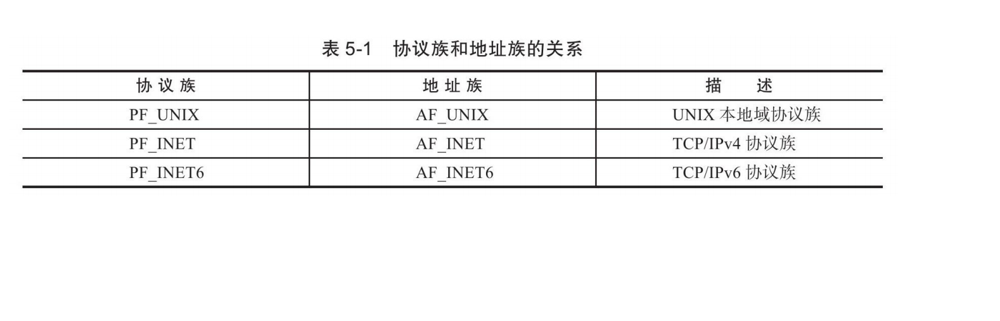
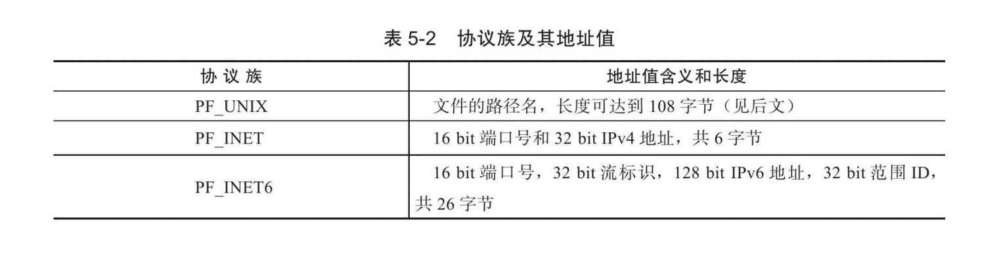

# 5.1 socket地址API

### 5.1.1**Linux提供的主机字节序和网络字节序转换API**
``````CPP
#include<netinet/in.h>
unsigned long int htonl(unsigned long int hostlong); //host to network long
unsigned short int htons(unsigned short int hostshort); 
unsigned long int ntohl(unsigned long int netlong);
unsigned short int ntohs(unsigned short int netshort);
``````
**注:** 长整形通常用来转换ip地址,短整形通常用来转换端口号

### 5.1.2 通用socket地址
``````CPP
#include<bits/socket.h>
struct sockaddr{
    sa_family_t sa_family;
    char sa_data[14];
}
``````
* **sa_family_t:** 该类型是地址族类型,地址族类型通常于协议族类型对应(protocol family,也称domain)。
* **sa_data:** 存放socket地址值

**常见的协议族类型和对应地址族类型图:**


**不同协议族的地址值:**


可见，sa_data无法容纳大多数协议族的地址值,linux提供类专用socket地址

### 5.1.3 专用socket地址
``````cpp
//unix本地域协议族
#include<sys/un.h>
struct sockaddr_un{
    sa_family_t sun_family;
    char sun_path[108];
}
//IPv4
#include<netinet/in.h>
struct sockaddr_in{
    sa_family_t sin_family; //地址族:AF_INET
    u_int16_t sin_port;   //16位端口号,需要用网络字节序
    struct in_addr sin_addr;
}
struct in_addr{
    u_int32_t s_addr; //ip地址,需要网络字节序
}
//IPv6
struct sockaddr_in6
{
    sa_family_t sin6_family;/*地址族：AF_INET6*/
    u_int16_t sin6_port;/*端口号，要用网络字节序表示*/
    u_int32_t sin6_flowinfo;/*流信息，应设置为0*/
    struct in6_addr sin6_addr;/*IPv6地址结构体，见下面*/
    u_int32_t sin6_scope_id;/*scope ID，尚处于实验阶段*/
};
struct in6_addr
{
    unsigned char sa_addr[16];/*IPv6地址，要用网络字节序表示*/
};
``````
**注:** 所有地址类型在实际使用时都需要转化为通用socket地址类型 sockaddr,因为所有socket接口都使用sockaddr

### 5.1.4 IP地址转换函数
通常，人们习惯用可读性好的字符串来表示IP地址，比如用点分
十进制字符串表示IPv4地址，以及用十六进制字符串表示IPv6地址。但
编程中我们需要先把它们转化为整数（二进制数）方能使用

**IPv4字符串与网络字节序的转换API:**
``````CPP
#include<arpa/inet.h>
int_addr_t inet_addr(const char *cp);
int inet_aton(const char*cp,struct in_addr *inp);
char *inet_ntoa(struct in_addr *addr);
``````
* **inet_addr:** 将字符串形式的IP地址转化为网络字节序的整数形式,失败返回INADDR_NONE
* **inet_aton:** 同上,但将结果存放在inp指向的地址结构中,成功返回1,失败返回0。
* **inet_ntoa:** 将网络字节序的整数形式的IP地址转化为字符串形式,注意该函数的结果以内部的静态变量存储,所以该函数不可重入

**通用ip地址字符串转网络字节序的转换API:**
``````C++
#include<arpa/inet.h>
int inet_pton(int af,const char*src,void*dst);
const char* inet_ntop(int af,const void*src,char *dst,socklent_t cnt);
``````
* **inet_pton:** 
1. int af:协议族类型 对于IPv4是AF_INET
2. const char * src: 字符串形式的IP地址
3. void *dst: 用于存储结果
4. 成功返回1,失败返回0,并设置errno

* **inet_ntop:** 
1. socklent_t cnt: 用于指定存储单元的大小,下面两个宏能帮助我们指定大小
``````CPP
#include<netinet/in.h>
#define INET_ADDRSLEN 16
#define INET6_ADDRSLEN 46
``````
2. 成功返回存储单元的地址,失败返回NULL,并设置errno